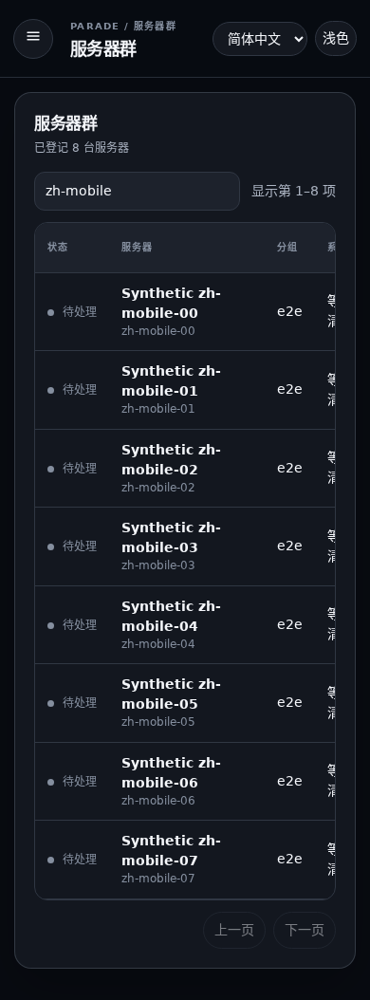
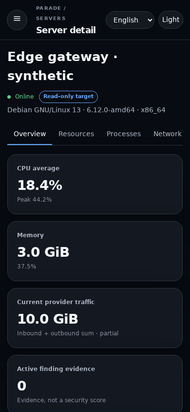
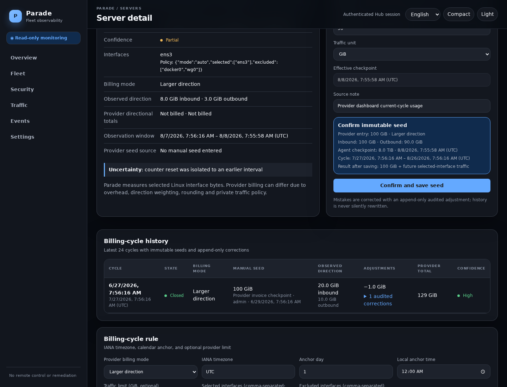
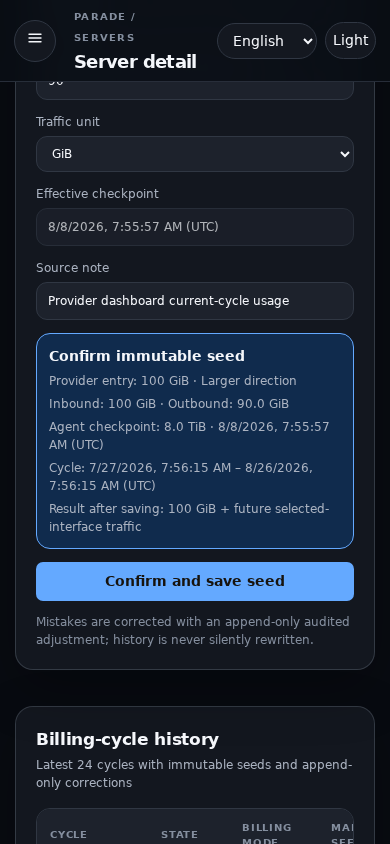

## Summary

This follow-up completes Parade's bilingual, bounded-resource VPS observability
experience while preserving the absolute read-only host boundary. It adds a
polished English/简体中文 UI and full Chinese lifecycle documentation, five exact
manual provider-traffic modes with visible cycle history, evidence-only
NAT/CGNAT topology, bounded findings and storage, safe interactive installation
and removal, isolated signed Release automation, and measured performance gates.

There is still no command/script/task/plugin API, remote shell, process/service/
package/firewall/user/file control, reboot, provider write action, peer relay,
automatic remediation, or arbitrary host path. Agents remain unprivileged,
outbound-only, and have no listening port. Hub observation requests remain a
closed, typed, size-bounded, expiring enum.

## Architecture and threat model

- One Rust Hub with embedded Preact assets and SQLite/WAL; one independent
  Ed25519 Agent identity per Linux VPS.
- Single-use, server-bound enrollment; signed version/server/Agent/time/
  sequence/message reports; durable replay, rotation, revocation and tombstones.
- Ten-second local sampling, compact five-minute+jitter rollups, bounded retry
  and one-report spool. Raw counter state checkpoints once per minute; pending
  reports, ACKs, identity and policy changes remain immediately durable.
- Procfs reads, interface/process/listener/anomaly collections, queues, retention
  passes, WAL, systemd memory/FD/task/log limits and finding series are bounded.
- Evidence topology is only verified Agent→Hub reporting edges (maximum 24),
  source category and shared-source counts. Raw source IPs, probes, peer mesh,
  relay routing and distributed persistence are absent.
- A root/kernel-compromised monitored host can falsify local telemetry; Parade
  authenticates source identity but never claims a host is clean or safe.

See `ARCHITECTURE.md` and `THREAT_MODEL.md` for the complete model.

## Manual traffic accounting

Provider APIs remain out of scope. The operator stores current-cycle provider
usage as an immutable seed at an exact Agent checkpoint; Parade adds later
selected-interface deltas and append-only audited corrections. Automatic
calendar rollover starts the next cycle at zero without resetting Linux
counters, preserves history, and labels unsplittable outage intervals estimated.

The closed modes are:

- inbound + outbound sum;
- inbound only;
- outbound only;
- larger current direction;
- independent inbound and outbound totals/limits.

Larger/separate modes require both directional provider seeds and reject an
ambiguous combined value. The UI uses the configured provider timezone, shows
the latest 24 cycles and up to 50 corrections per cycle, and never applies an
unsaved billing-mode draft to a seed.

## UI and Simplified Chinese

- English/简体中文 selection on login and authenticated surfaces, persisted
  locally; Chinese dates use `YYYY年MM月DD日 HH:mm:ss`.
- Local-only Apple-system visual treatment, light/dark themes, comfortable/
  compact density, visible focus, reduced motion and ~390 px navigation.
- Fleet CPU/memory/disk/finding/traffic columns; evidence-rich overview;
  bounded resource trends; privacy-preserving processes; listeners; findings;
  events/audit; traffic equations, projections, history and uncertainty.
- No external fonts, scripts, trackers, analytics or CDN at runtime.

`README.zh-CN.md` and `docs/zh-CN/OPERATIONS.md` cover installation through
TLS/proxy setup, multi-host enrollment, traffic seeding, backup/restore,
rotation, upgrade, uninstall, troubleshooting and validation.

## Bilingual documentation

- Added paired English/简体中文 documentation indexes, getting-started,
  production deployment, provider traffic accounting, resource-budget and
  troubleshooting guides, following the concise entry/index/deep-reference
  structure of the operator-provided read-only `rust-reality` reference.
- Added a complete English build-to-retirement lifecycle counterpart to the
  existing Chinese lifecycle manual, plus a Chinese security policy.
- Both root READMEs now expose the same language map. Commands distinguish the
  convenient one-line bootstrap from independently pinned, explicit-tag
  high-assurance Release verification and do not claim `curl | bash`
  authenticates itself.
- Documentation preserves the product boundary: Agents remain outbound-only,
  NAT requires no Parade ingress, topology is report evidence rather than a
  mesh, and diagnosis never disables signature/TLS/replay checks or adds remote
  control.

## Release and installer safety

- The tag workflow verifies Cargo/tag equality and default-branch reachability,
  runs complete checks and builds every advertised Agent architecture before
  any signing secret is available.
- Only the isolated sign step receives `PARADE_RELEASE_SIGNING_KEY_B64`; it
  signs manifests, verifies signatures and emits a deterministic Agent archive.
- The Hub installer is bilingual and refuses an existing/partial install rather
  than guessing an in-place migration. Agent rotation stages binary, unit and
  new identity before single-use token redemption, then commits them together.
- The release bootstrap explicitly documents that `curl | bash` initially
  trusts GitHub HTTPS; high-assurance download/verify/review commands are in the
  production deployment guides and pin `PARADE_VERSION` to the same explicit
  tag for every subsequent download. Convenience uninstall has the same GitHub
  HTTPS trust called out; its high-assurance path pins a tag, verifies the signed
  checksum and runs a reviewed local script. Uninstall is local-only and
  preserves data unless `--purge` is explicitly selected.

## Migration

Migration 4 adds the five billing modes, directional seeds/limits/adjustments,
retention indexes, and bounded `security_findings.series_key`. Legacy combined
traffic remains `sum`; duplicate legacy finding rows are merged while preserving
first/last/occurrence history. Wire protocol version 2 is an explicit upgrade
boundary. See `MIGRATION.md`.

## Checks run locally

- `cargo fmt --all -- --check` — passed.
- `cargo clippy --workspace --all-targets --all-features -- -D warnings` —
  passed.
- `cargo test --workspace --all-features` — 40 passed (Agent 13, common 3,
  Hub 24).
- Frontend Prettier, ESLint, TypeScript, five Vitest tests and production Vite
  build — passed.
- Playwright Chromium desktop/mobile/auth/evidence/traffic/Chinese suite —
  8 passed. Twelve synthetic screenshots written, including 390 px server and
  traffic views and an actual mocked seed POST/reload flow.
- Bash syntax, user-space ShellCheck 0.10.0 and installer integrity test — passed.
- `scripts/performance-gate.sh` — passed with locked normal Release binaries.

The first direct Playwright attempt failed before launch because this host lacked
`libnspr4.so`; the complete suite passed using the prepared user-space library
path. A parallel local frontend/Hub build also once embedded the previous asset;
the required ordered frontend-then-Hub rebuild passed. Neither is claimed as a
product check pass. `cargo deny check` passed advisories, license, ban and source
policy (with two reported duplicate transitive families). Local `cargo audit`
was blocked by the advisory-database network fetch, while GitHub Actions run
`31247485992` completed RustSec successfully on the pre-documentation head.
The documentation-only head will rerun CI. Gitleaks, `nginx -t` and real distro/
systemd installs remain unavailable locally; the equivalent workspace secret
scan is clean.

## Measured bandwidth and load

- Normal profile: 390-byte body, 8,640 reports/30 days, 250 B request overhead,
  2,048 B TLS reconnect/day, and a conservative allocation equivalent to one
  3,469 B 32-process snapshot/day =
  **5,695,110 B / 5.431 MiB per Agent-month**.
- Release binaries: Agent **2,947,936 B**, Hub **6,302,600 B**.
- 1,000 signed reports: setup **256 ms**, ingest **13,681 ms** (**73.1/s**),
  fleet query **4.266 ms**, database **1,822,720 B**.
- Idle release Hub: peak **8,612 KiB RSS**, **7 FDs**, **5 threads**, initial
  SQLite **266,240 B**.
- Embedded app JS+CSS: **37.59 kB gzip**; login JS: **1.14 kB gzip**.

The Agent does not schedule a daily process snapshot; stable evidence changes
and typed leases drive real snapshot uploads. The host used `powersave` and
`perf_event_paranoid=3`; these numbers are a regression baseline, not hardware-
independent capacity claims. Live-detail and genuine event bursts are excluded
from the normal monthly estimate and have separate byte accounting.

## Screenshots

All data is synthetic.

## Known limitations / deferred work

- Authentication/journal rules, OOM/kernel/filesystem/service signals, per-core
  and disk-I/O detail, conntrack, package ownership and remote endpoint
  aggregation need additional distro fixtures and disposable-host validation.
- Resource trends cover 72 retained rollups, not multi-year downsampling. Fleet
  saved views/sort controls, event query filters, and finding acknowledgment/
  suppression UX remain deferred.
- Fleet-wide pressure/finding totals cover every server, but the interactive
  attention list is still built from the bounded first 500 records. Fleet-wide
  per-server traffic projection tables remain deferred.
- The current UI appends adjustments only to the open cycle. Closed-cycle final
  provider corrections and a first-class accounting-epoch transition API are
  deferred; after seeded history, interface policies/limits remain editable but
  timezone, anchor and billing mode intentionally cannot reinterpret history.
- Uptime/boot metadata is sampled but not yet persisted as inventory. Process
  socket ownership/package provenance and armv7 disk/inode capacity report
  explicit unavailable values pending portable collectors.
- Specialized traffic regressions now cover IPv6 selection, rename continuity,
  32-bit wrap, exact seeds, direction formulas, rollover and replay durability;
  bridge/member topology fixtures, concurrent HTTP ingest and broader property
  testing remain deferred.
- Synchronous rusqlite work uses short, rate-limited transactions; bounded
  blocking workers need a measured HTTP/TLS reconnect-burst benchmark first.
- Alerts remain in-console; provider integrations are intentionally absent.
- The first signed GitHub Release is blocked on repository secret
  `PARADE_RELEASE_SIGNING_KEY_B64`, then a matching version tag reachable from
  the default branch. Real Debian/Ubuntu/Alma/Rocky systemd installs still need
  disposable VPS validation.

Keep this PR draft. Do not merge automatically.
