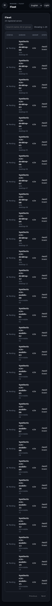
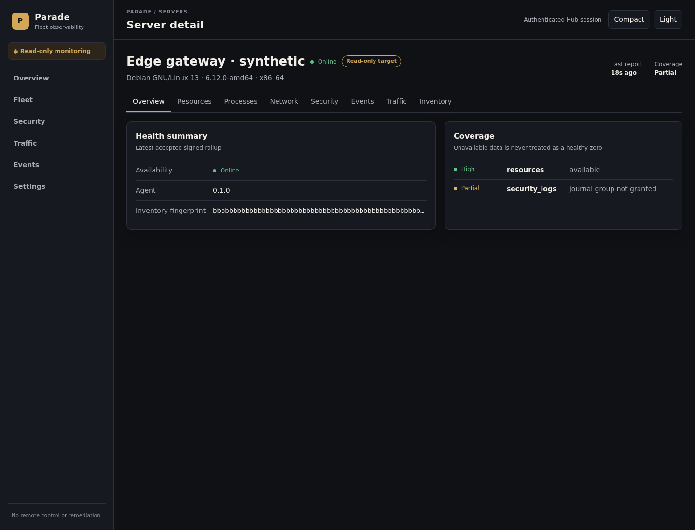
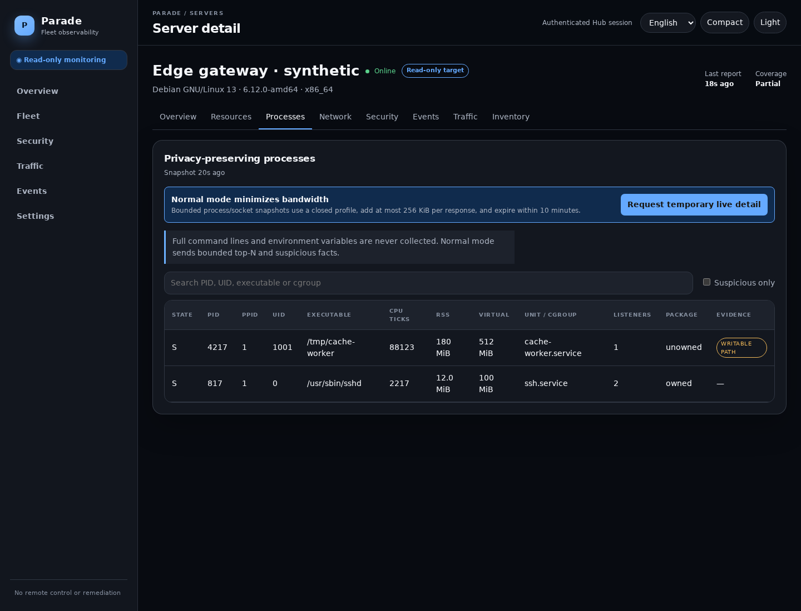
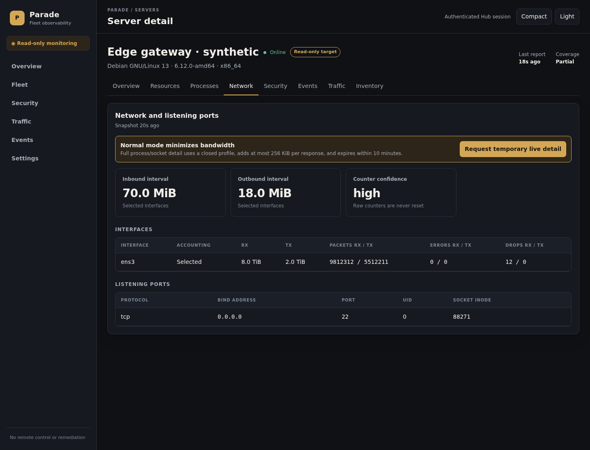
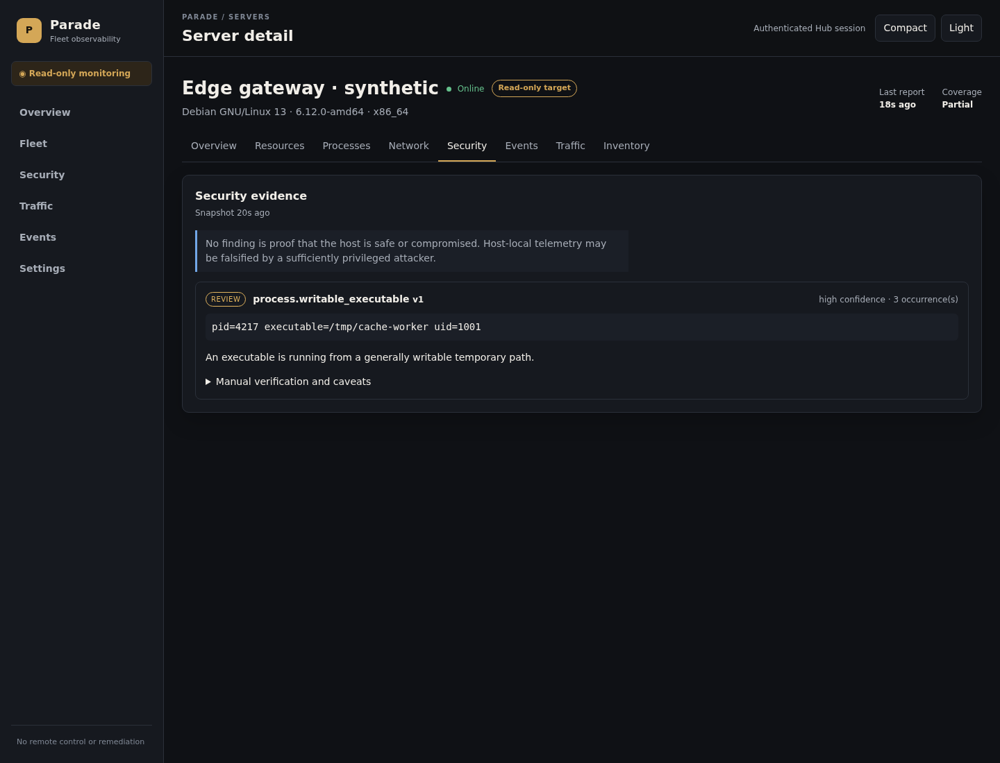

## Summary

Parade is now a self-contained, low-bandwidth, strictly read-only Linux VPS
fleet observability and security-posture console: one Rust Hub with embedded
SQLite/WAL and Preact assets, plus one unprivileged outbound-only Rust Agent per
host.

The monitored-host boundary is structural. There is no command/script/job/
plugin API, shell, process/service/package/firewall/user/file control, reboot,
provider write action, or remediation path. The only Hub-to-Agent requests are
closed, versioned, expiring observation profiles with no user command/path text.

## Verified original defects

The repository audit in `AUDIT.md` verified and remediated the unsafe empty
dashboard authentication, fleet bearer identity, missing report authentication
and replay state, resurrection through auto-registration, mutable JSON state,
global locking, traffic resets, synchronized/high-bandwidth reporting, broken
DynamicUser ownership, TLS build mismatch, weak artifact validation, ignored
installer failures, proxy trust, unbounded work, and absent test/CI coverage.

## Architecture and threat model

- Per-Agent Ed25519 keys; 15-minute, hashed, single-use, server-bound enrollment
  tokens; transactional credential rotation, revocation, and tombstones.
- Signed protocol version/server/Agent/time/sequence/message/body; strict
  content type, 256 KiB limit, freshness, identity, timestamp, replay, and
  monotonic-checkpoint validation.
- SQLite WAL, foreign keys, immediate security/accounting transactions, three
  explicit migrations, indexed fleet/time queries, and bounded retention.
- Ten-second local sampling and compact five-minute rollups with jitter,
  backoff, one-item persistent spool, changed-only process/listener facts, and
  no environments or full command lines.
- Closed observation leases expire within ten minutes. Requests/cancellations
  are audited; responses must match the exact profile/lease and have measured
  encoded bytes.
- Offline Ed25519 release-manifest signature, pinned public key/manifest,
  per-binary checksum, HTTPS, actual binary self-test, static unprivileged
  service, and root-owned Hub-read-only artifact staging.

`THREAT_MODEL.md` covers token/key theft, compromised VPSes, replay and
cross-server impersonation, malicious Hub users, proxy spoofing, database and
artifact theft, telemetry poisoning, process-secret leakage, root/kernel
compromise, Agent/report floods, and alert floods. Agent signatures establish
source identity, not host truth.

## Manual traffic accounting

Provider APIs remain out of scope. For each server the operator configures the
IANA timezone/calendar anchor, limit, and selected/excluded interfaces, then
enters current provider-used bytes at the displayed exact Agent checkpoint.

```text
current cycle = immutable provider seed
              + selected Linux bytes observed after that checkpoint
              + append-only audited adjustments
```

Agent totals remain monotonic across restart, reboot, reset, and Hub outage.
The Hub creates every due monthly cycle without resetting Linux counters.
Day-31 and DST behavior is deterministic; outage intervals that cannot be split
exactly remain visibly estimated and can be corrected without rewriting
history. The UI exposes seed/source/time, RX/TX additions, corrections, limit,
projection, interface policy, confidence, and cycle boundaries.

## Migration and retention

Migration 1 establishes the independent identity/replay/session/audit/finding/
traffic schema. Migration 2 links observation responses to leases and adds
encoded-byte/cancellation accounting. Migration 3 persists the Agent's last
delivered interface-policy version so policy updates allow one authenticated
transition report, survive lost acknowledgements, and then reject stale policy
use. Newer unknown schemas fail closed.

There is deliberately no automatic importer from the insecure legacy JSON
identity/month-total format. Re-enroll each Agent, wait for a reliable
checkpoint, and seed it from the provider dashboard. See `MIGRATION.md`.

Detailed resources retain 30 days; traffic rollups 90 days; process/socket
changes seven days plus latest; events 180 days; raw checkpoints 400 days while
preserving seed-tied/latest checkpoints. Identity, audit, findings, tombstones,
seeds, adjustments, and cycle history are durable.

## Checks executed

- `cargo fmt --all -- --check` — passed.
- `cargo clippy --workspace --all-targets --all-features -- -D warnings` —
  passed.
- `cargo test --workspace --all-features` — 22 passed, 0 failed.
- `cargo build -p parade-agent --release --all-features` — passed.
- Current-host `scripts/build-agents.sh --gnu-only` with a temporary Ed25519
  key and independent `openssl pkeyutl -verify` — passed.
- Frontend Prettier, ESLint, TypeScript, Vitest, and production Vite build —
  passed. JS+CSS: 61.52 kB raw / 19.52 kB gzip combined.
- Playwright Chromium desktop/mobile/authenticated/responsive/evidence/traffic
  suite — 5 passed, 1 deliberate non-desktop visual skip.
- Bash syntax and installer negative-integrity/order test — passed.
- ShellCheck 0.10.0 — passed for every supplied shell file.
- `npm audit --audit-level=high` — 0 vulnerabilities.
- Workspace secret-pattern and monitored-host boundary scans — no candidates or
  forbidden implementation paths found.

`cargo-audit 0.22.2` installed successfully in an isolated prefix, but the
RustSec advisory database fetch failed with a Git transport I/O error; a direct
shallow clone also stalled and was interrupted after a bounded wait. No RustSec
pass is claimed. `cargo deny`, Gitleaks, `nginx -t`, and distro-level systemd
installation tests were unavailable. CI installs and runs ShellCheck and
`cargo audit` on Ubuntu.

## Measured bandwidth and load

- Normal profile: 390-byte encoded body × 8,640 reports/30 days, plus 250 bytes
  assumed request overhead/report and 2,048 bytes TLS reconnect/day =
  **5,591,040 bytes / 5.332 MiB per Agent-month**. Detail leases and real event
  bursts are excluded and measured separately.
- Synthetic SQLite test: **1,000 Agents**, setup **212 ms**, ingestion
  **9,636 ms**, **103.8 reports/s**, fleet-count query **0.888 ms**, database
  **1,761,280 bytes**.

## Screenshots

All data is synthetic.













## Known limitations / deferred work

- Authentication/journal rules (SSH/root/sudo), OOM/kernel/filesystem/service
  signals, clock skew, conntrack, disk I/O, package ownership, and remote
  endpoint aggregation need additional distro fixtures and disposable-host
  validation. Missing coverage is explicit and never treated as healthy zero.
- Long-term synchronized charts/hourly downsampling, traffic cycle-history UI,
  Fleet saved views/sort/columns, event filters, and finding acknowledgment/
  suppression controls remain future work.
- rusqlite work is currently synchronous inside async handlers; a future
  full-stack load pass should use bounded blocking workers and measure HTTP/TLS
  reconnect bursts and memory.
- Alerts are in-console findings/events only. External delivery and provider
  integrations are deliberately deferred.
- Cross-architecture signed releases and real systemd installs require the
  operator's offline release key and disposable Debian/Ubuntu/Alma/Rocky VPSes.

## Disposable-VPS manual validation

1. Generate a unique Hub password hash on stdin; configure a loopback listener,
   HTTPS public origin, exact proxy IP, SQLite path, artifact path, and release
   public-key SHA-256.
2. Generate/secure an offline Ed25519 release key and run
   `PARADE_RELEASE_SIGNING_KEY=/secure/path scripts/build-agents.sh`.
3. Install/start the Hub service, validate `nginx -t`, and confirm HTTPS login,
   CSP/security headers, Secure cookie, and untrusted XFF rejection.
4. In Settings create one disposable server and copy its complete expiring
   enrollment command to a disposable VPS. Verify the `parade` process is
   unprivileged, owns only `/var/lib/parade-agent`, has no listening socket, and
   continues after reboot/network interruption.
5. Verify Fleet freshness, coverage limitations, resources, privacy-preserving
   processes, interfaces/listeners, evidence, events, and a ten-minute typed
   lease including countdown, response bytes, early cancellation, and expiry.
6. Configure a near-term test billing boundary, add a provider seed, generate
   ordinary traffic, restart Agent and Hub, cross the boundary, and confirm the
   seed/observed/adjustment equation, zero-seed new cycle, preserved history,
   and explicit uncertainty for an outage spanning the boundary.
7. Try a reused enrollment token, replayed report, wrong server identity,
   modified signed body, oversized/wrong-content report, tombstoned server, bad
   artifact signature, and failed re-enrollment. Each must fail closed; a prior
   active Agent should remain installed/running after failed upgrade enrollment.

This pull request must remain draft until those disposable-host checks are
reviewed. Do not merge automatically.
