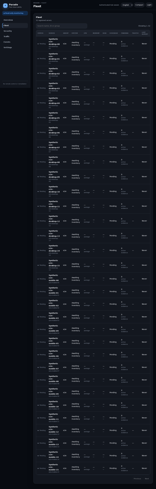
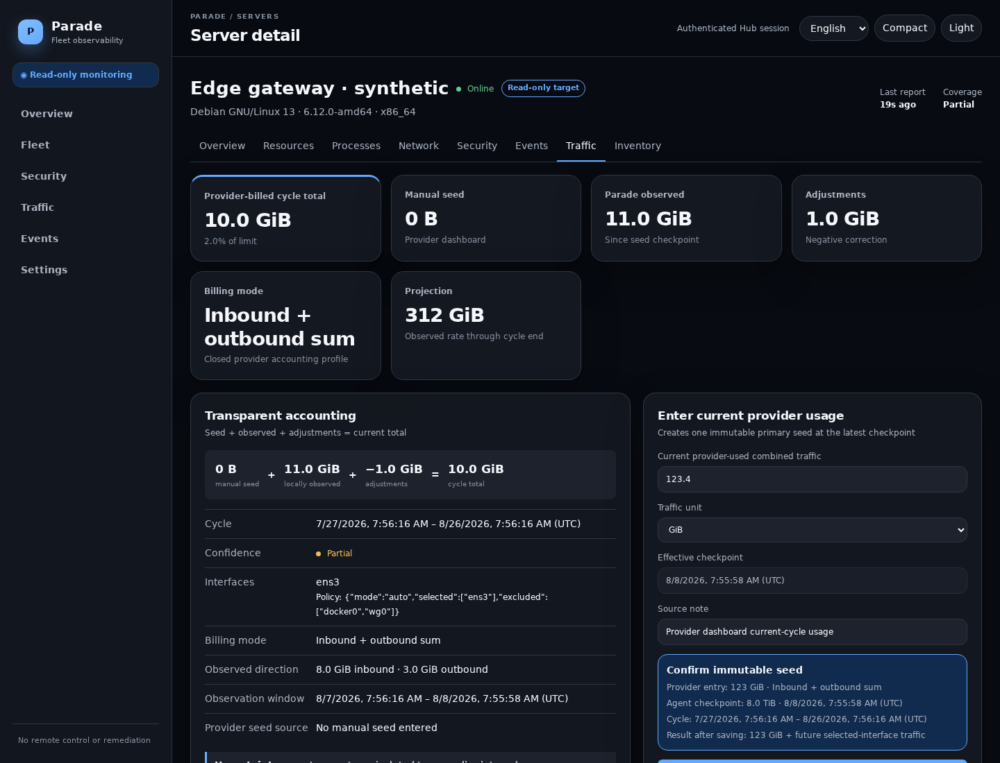

# Parade

[](https://github.com/jacek4yang/parade/actions/workflows/ci.yml)
[](https://github.com/jacek4yang/parade/releases)

[English](README.md) | [简体中文](README.zh-CN.md)

New operator? Follow the [getting-started guide](docs/getting-started.md), then
complete the [production deployment checklist](docs/deployment.md).

Parade is a self-hosted, low-bandwidth, strictly read-only Linux VPS fleet
observability and security-posture console. It collects resource, network,
privacy-preserving process, listener, coverage, event, and traffic evidence. It
may explain and alert; it cannot remotely control or modify a monitored VPS.

There is one Rust Hub binary, one outbound-only Rust Agent per monitored host,
an embedded Preact UI, and embedded SQLite/WAL persistence. Production has no
mandatory database server, broker, CDN, analytics, provider integration, or
frontend runtime dependency.

```text
browser --HTTPS--> reverse proxy --> Parade Hub --> SQLite WAL
                                        ^
                                        | signed compact reports / TLS
                                        |
                         unprivileged outbound-only Agents
                              read /proc and /sys only
```

## Safety boundary

Monitored VPSes are observation targets. Parade has no arbitrary command,
shell, script, task, plugin, file management, process/service/package/firewall/
user control, reboot, shutdown, reinstall, provider write, or remediation API.
The Hub can request additional detail only through a closed, versioned enum of
read-only profiles with strict limits and at most a ten-minute expiry.

Every Agent has an independent Ed25519 identity. Enrollment tokens are
short-lived, single-use, hashed, and bound to one pre-created server. Signed
reports contain version, server/Agent IDs, time, monotonic sequence, unique
message ID, and body; replay, staleness, cross-server identity, wrong content
type, malformed encoding, unsupported versions, and oversized bodies fail
closed.

Host-local telemetry is not attestation. A root- or kernel-compromised machine
can hide activity or lie to Parade. The UI never claims a server is clean, safe,
or uncompromised.

## What is included

- Fleet overview and paginated/scannable fleet table for large installations.
- CPU/load, memory/swap, PSI, disk/inodes, uptime, socket, OS/kernel/architecture,
  interface traffic, freshness, and collector coverage.
- Bounded top-N and suspicious process facts without environment variables or
  full command lines; changed listening ports and temporary typed snapshots.
- Evidence-based, versioned findings with confidence, recurrence, explanation,
  verification guidance, and limitations.
- Events, operator audit history, themes, density, keyboard focus, reduced
  motion, and desktop/~390 px responsive layouts.
- Transparent manual-seed traffic accounting with automatic calendar rollover.
- Compact five-minute rollups, jitter, bounded retry/spool, and a deterministic
  below-10-MiB/month default synthetic bandwidth test.

## Interface

The Playwright suite generates non-sensitive synthetic views directly into the
repository. They exercise the same embedded production bundle served by the
Hub.





Additional views: [390 px Fleet](docs/screenshots/fleet-mobile.png),
[process evidence](docs/screenshots/process-evidence-desktop.png),
[network evidence](docs/screenshots/network-evidence-desktop.png),
[security evidence](docs/screenshots/security-evidence-desktop.png), and
[server overview](docs/screenshots/server-overview-desktop.png).

The interface includes English and Simplified Chinese, remembers the local
choice, follows the browser language on first use, and renders Chinese dates as
`YYYY年MM月DD日 HH:mm:ss`. All assets and system fonts are local; there are no
external fonts, trackers, scripts, or CDNs.

## One-line HTTPS bootstrap with signed payloads

For a tagged GitHub Release, install the Hub on x86_64 or aarch64 Linux with:

```bash
curl -fsSL https://github.com/jacek4yang/parade/releases/latest/download/parade-install.sh | sudo bash -s -- hub
```

This convenience command trusts GitHub HTTPS for the bootstrap script itself;
the running bootstrap then authenticates every downloaded payload with the
pinned/confirmed Ed25519 release key. It must not be described as authenticating
itself. High-assurance operators should first select one explicit Release tag,
download and verify its `SHA256SUMS.release` signature using an independently
obtained public-key digest, review the script, then execute it with the same
tag in `PARADE_VERSION`. Follow the [English](docs/deployment.md#high-assurance-release-verification)
or [Simplified Chinese](docs/deployment.zh-CN.md#高保障-release-验证)
production deployment guide.

The installer detects Linux and CPU architecture, prompts for English or
简体中文 through the controlling terminal, verifies the release public-key
fingerprint, Ed25519 signature, manifest, binary checksum and Hub self-test,
then asks only for the public origin and administrator password. For unattended
installation, explicitly supply `PARADE_LANG`, `PARADE_PUBLIC_URL`,
`PARADE_ADMIN_PASSWORD`, and the trusted `PARADE_RELEASE_KEY_SHA256` pin.

After login, create one server record per VPS and run its unique 15-minute,
single-use enrollment command on that exact machine. Repeat for hosts A, B, C,
and so on; never reuse a command or credential. NAT/CGNAT Agents need no port
mapping because every connection is outbound HTTPS. Public-IP Agents still
open no Parade listener. A Hub behind NAT must have an operator-provided HTTPS
origin reachable by every Agent; Parade never changes firewalls, routes, port
forwards, VPNs, or tunnels.

The Release workflow is triggered by a matching `v*` tag and requires protected
`signed-release` environment secrets `PARADE_RELEASE_SIGNING_KEY_B64` and
`PARADE_RELEASE_PUBLIC_KEY_SHA256`. It publishes signed static Hub binaries,
the multi-architecture Agent tree, checksums, and both installer scripts. It
fails closed when the signing secret, the operator-pinned public-key digest or a
primary architecture is missing.

## Build

Prerequisites are a current stable Rust toolchain and Node.js for rebuilding the
embedded UI.

```bash
cd frontend
npm ci
npm run build
cd ..
cargo build --release --workspace --all-features --locked
```

The UI build writes `hub/assets/app.js`, `app.css`, `login.js`, and the embedded
HTML. The Hub binary then includes those assets at compile time.

Generate the administrator password hash without putting a real password in
Git:

```bash
read -rsp 'Hub administrator password: ' parade_admin_password
printf '\n'
printf '%s\n' "$parade_admin_password" | target/release/parade-hub hash-password
unset parade_admin_password
```

## Hub setup

Create the dedicated account and private paths, install the binary and example,
then replace `password_hash`, `public_url`, and proxy addresses locally:

```bash
sudo useradd --system --home-dir /var/lib/parade --shell /usr/sbin/nologin parade-hub
sudo install -d -o root -g parade-hub -m 0750 /etc/parade
sudo install -d -o parade-hub -g parade-hub -m 0700 /var/lib/parade
sudo install -o root -g root -m 0755 target/release/parade-hub /usr/local/bin/
sudo install -o root -g parade-hub -m 0640 config/hub.toml /etc/parade/hub.toml
sudo install -o root -g root -m 0644 systemd/parade-hub.service /etc/systemd/system/
sudo systemctl daemon-reload
sudo systemctl enable --now parade-hub
```

The safe default listener is `127.0.0.1:8008`. Terminate HTTPS at a maintained
reverse proxy; adapt `nginx/parade.conf`, set HSTS only after HTTPS works, and
list only the immediate proxy IPs in `trusted_proxies`. Parade never infers its
public URL from forwarded or Host headers.

## Build and stage Agent releases

Create and protect an offline Ed25519 release key outside this repository (once):

```bash
umask 077
openssl genpkey -algorithm Ed25519 -out /secure/offline/parade-release.key
```

The release script builds TLS-enabled artifacts, writes each target under
`dist/<triple>/parade-agent`, produces `SHA256SUMS`, signs it, and exports the
public key. The private key path is supplied only to the offline build process:

```bash
parade_agent_stage=$(mktemp -d)
PARADE_RELEASE_SIGNING_KEY=/secure/offline/parade-release.key \
  scripts/build-agents.sh --dist "$parade_agent_stage"
sha256sum "$parade_agent_stage/release-public.pem"
sudo install -d -o root -g parade-hub -m 0750 /var/lib/parade-dist
sudo cp -a "$parade_agent_stage"/. /var/lib/parade-dist/
sudo chown -R root:parade-hub /var/lib/parade-dist
sudo chmod -R u=rwX,g=rX,o= /var/lib/parade-dist
```

Review the user-writable staging tree before copying it into the root-owned Hub
tree; remove the staging directory afterward according to local policy. `cross`
is required for the complete x86_64/aarch64/armv7 musl+GNU targets plus the
riscv64 GNU target; without it the script builds only an available host target
and must not advertise absent architectures. Static musl is preferred where it
is published, with GNU fallback. The Agent requires
Linux/systemd for the supported one-command install. Debian, Ubuntu, AlmaLinux,
and Rocky Linux are the primary targets; unsupported collectors degrade with an
explicit coverage reason.
Put the printed public-key digest in `release_public_key_sha256`. The Hub service
has read-only access to the root-owned artifact tree; the installer verifies the
configured key pin, detached offline signature, manifest digest, and binary
checksum before execution.

## One-command enrollment

In Settings, create a server record. Parade mints a 15-minute one-use token and
an enrollment command containing a pinned SHA-256 digest of the release
manifest. Copy the complete command to that VPS. The installer:

1. requires HTTPS outside loopback development;
2. verifies the pinned manifest and selected Agent binary;
3. runs the actual Agent `--version` self-test;
4. creates the static unprivileged `parade` user and private state directory;
5. generates a fresh local signing identity and atomically consumes the token;
6. validates config/state readability as that user; and
7. starts a hardened outbound-only systemd service, failing if it is inactive.

On upgrade, the existing Agent binary is not replaced until enrollment has
succeeded. Failures before token redemption restart a previously active
service. Once redemption starts, a lost response may mean the Hub already
revoked the old credential; Parade therefore leaves the old service stopped
instead of performing a false rollback. Issue a fresh one-use token and rerun
the installer. Hub and Agent may safely share a VPS: `/etc/parade` is a
root-owned traversal directory while each component config remains readable
only by its own service group.

No per-Agent TOML editing and no fleet-wide credential are required.

## Manual current-cycle traffic workflow

Provider APIs are deliberately outside this milestone. Parade implements the
provider-dashboard workflow directly:

1. Open a server's Traffic tab and configure its IANA timezone, day 1–31, local
   boundary time, optional provider limit, and interface policy.
2. Wait for the first reliable Agent checkpoint.
3. Read the provider dashboard's already-used current-cycle traffic.
4. Enter that value and source note. Confirm the exact checkpoint/effective
   time; Parade stores one immutable primary seed.
5. Parade displays and updates:

   ```text
   manual provider seed
   + Linux bytes observed after the seed checkpoint
   + append-only audited corrections
   = current cycle total
   ```

6. At the configured monthly boundary the Hub automatically opens a zero-seed
   cycle without resetting Linux counters. Closed cycles and audit history stay
   intact. If a report interval straddles the boundary, the split is visibly
   `estimated` and is refined from adjacent checkpoints after reconnection.

Linux cannot reconstruct bytes from before Parade began observing. Provider
billing may differ because of direction weighting, protocol overhead, rounding,
private traffic, or provider policy. Parade shows the selected interfaces,
source, timestamps, components, and uncertainty rather than hiding those gaps.

The billing rule is a closed enum: inbound+outbound sum, inbound only, outbound
only, larger direction, or separate inbound/outbound totals and limits. The
larger-direction and separate modes require both provider directional values at
the seed checkpoint; Parade rejects an ambiguous combined value. No custom
formula, script, or provider code can be supplied.

## Resource expectations

The normal synthetic protocol body and request/TLS assumptions are measured by
`default_monthly_bandwidth_is_below_target`. The regression fails above 20 MiB
and targets below 10 MiB upload per Agent per 30 days, excluding explicit
live-detail sessions and genuine event bursts. The final measured value for the
current tree is recorded in `PLANS.md`.

Detailed resources retain 30 days, traffic rollups 90 days, process/socket
changes seven days plus the latest value, and events 180 days. Identity, replay,
audit, findings, tombstones, manual seeds, adjustments, and cycle totals are
durable. Raw traffic checkpoints are bounded to 400 days while preserving every
seed checkpoint and the latest checkpoint per server.

Operational deletion runs in 10,000-row transactional batches. Agent state
keeps one pending report, at most 64 reported interfaces, 32 traffic anomalies,
and 256 same-boot interface baselines; procfs reads are capped at 1 MiB. Normal
raw-counter state is checkpointed at most once per minute instead of every
ten-second sample, while boot/reset/new-counter transitions, a pending report,
acknowledgement, identity or policy change remain immediately durable. SQLite
auto-checkpoints WAL and limits the
retained journal to 16 MiB. Supplied systemd units enforce Agent
`MemoryMax=128M` and Hub `MemoryMax=512M`, bounded tasks/file descriptors,
log-rate limits, and restart limits. Journald's total disk quota remains an
operator-wide setting and is not silently changed.

`scripts/performance-gate.sh` builds locked release binaries, records their
hashes and machine/Git metadata, rejects reintroduced WebSocket/gzip runtime
dependencies, runs the deterministic bandwidth and 1,000-Agent tests, and
samples an idle release Hub on Linux. On the recorded 2026-08-08 local run the
Agent was 2,947,936 bytes, the Hub 6,302,600 bytes, and the conservative normal
upload budget was 5.431 MiB per Agent per 30 days (allocating bytes equivalent
to one 32-process snapshot per day). The 1,000 signed reports ingested at 73.1
reports/s, and the idle Hub peaked at 8,612 KiB RSS, 7 file descriptors and 5
threads. The Agent does not schedule a daily process snapshot; it sends bounded
process evidence when the stable evidence hash changes or a typed lease requests
it, so real changes/events add traffic differently. The host was using the
`powersave` governor with `perf_event_paranoid=3`; these are a reproducible
regression baseline, not hardware-independent capacity claims.

Audit events, identities, tombstones, findings, traffic seeds, corrections and
cycle history are intentionally durable low-frequency evidence, so Parade does
not claim the SQLite file can never grow under unlimited operator actions.
Export/backup according to policy and review durable history during long-lived
installations.

## Backup, restore, and upgrade

Use SQLite's online `.backup` command/API, or stop the Hub and copy the database
with any WAL/SHM files. Encrypt backups and test restoration. Upgrade only after
a consistent backup; migrations run transactionally before the listener opens.
See `MIGRATION.md` for rollback and the safe legacy-JSON transition. Restoring
an old identity/replay database requires security review because Agents may have
advanced beyond its cursors.

## Uninstall

The Release-provided one-line uninstaller removes only local Parade components and
preserves configuration/state by default:

```bash
curl -fsSL https://github.com/jacek4yang/parade/releases/latest/download/parade-uninstall.sh | sudo bash -s -- agent
curl -fsSL https://github.com/jacek4yang/parade/releases/latest/download/parade-uninstall.sh | sudo bash -s -- hub
```

These convenience commands trust GitHub HTTPS for a root-level script. For
high assurance, pin an explicit Release tag, verify the script through the
signed `SHA256SUMS.release` and independently trusted public-key digest, review
it, and run it locally as shown in [production deployment](docs/deployment.md#local-removal).

Add `--purge` only after preserving required evidence and backups. The script
requires an explicit terminal confirmation; unattended use additionally
requires `PARADE_CONFIRM_UNINSTALL=uninstall`. Parade can never invoke it
remotely.

The supplied uninstaller checks Parade ownership markers before considering a
service account removable; it preserves pre-existing or unverifiable accounts.
Review `/var/lib/parade-agent` before `--purge` because its local identity and
traffic state may be needed for investigation. Parade never initiates uninstall
remotely.

For the Hub, stop/disable its service, preserve the SQLite backup and audit
records, then remove the binary/config/service and dedicated user at the local
operator's discretion.

## Troubleshooting

- Hub refuses startup: validate every TOML field and generate a real Argon2id
  hash; remote `public_url` must be HTTPS and path-free.
- No enrollment command: build/stage `SHA256SUMS` and target artifacts in
  `dist_dir` with readable ownership.
- Installer verification fails: do not bypass it. Rebuild/stage the release and
  mint a new command so the pinned digest matches.
- Agent service fails: inspect `journalctl -u parade-agent -e`; verify the
  `parade` user can read `/etc/parade/agent.toml` and read/write its private
  state. `sudo -u parade parade-agent check-config /etc/parade/agent.toml` must
  succeed.
- Traffic says awaiting checkpoint: allow one signed Agent rollup before adding
  a manual provider seed.
- Partial/unsupported security data: grant no extra privilege automatically.
  Review collector coverage and, only if acceptable, add the documented narrow
  read-only log group locally.

## Documentation

| Guide | English | 简体中文 |
| --- | --- | --- |
| Documentation index | [English](docs/index.md) | [简体中文](docs/index.zh-CN.md) |
| Getting started | [English](docs/getting-started.md) | [简体中文](docs/getting-started.zh-CN.md) |
| Production deployment | [English](docs/deployment.md) | [简体中文](docs/deployment.zh-CN.md) |
| Complete lifecycle | [English](docs/operations.md) | [简体中文](docs/zh-CN/OPERATIONS.md) |
| Provider traffic accounting | [English](docs/traffic-accounting.md) | [简体中文](docs/traffic-accounting.zh-CN.md) |
| Resource budgets | [English](docs/resource-budgets.md) | [简体中文](docs/resource-budgets.zh-CN.md) |
| Troubleshooting | [English](docs/troubleshooting.md) | [简体中文](docs/troubleshooting.zh-CN.md) |
| Security policy | [English](SECURITY.md) | [简体中文](SECURITY.zh-CN.md) |

## Development verification

```bash
cargo fmt --all -- --check
cargo clippy --workspace --all-targets --all-features -- -D warnings
cargo test --workspace --all-features
cd frontend
npm run format:check
npm run lint
npm run typecheck
npm test
npm run build
npx playwright test
```

Architecture, audit, threat model, operational security, migration boundary,
and exact executed check results are in [ARCHITECTURE.md](ARCHITECTURE.md),
[AUDIT.md](AUDIT.md), [THREAT_MODEL.md](THREAT_MODEL.md),
[SECURITY.md](SECURITY.md), [MIGRATION.md](MIGRATION.md), and
[PLANS.md](PLANS.md).
