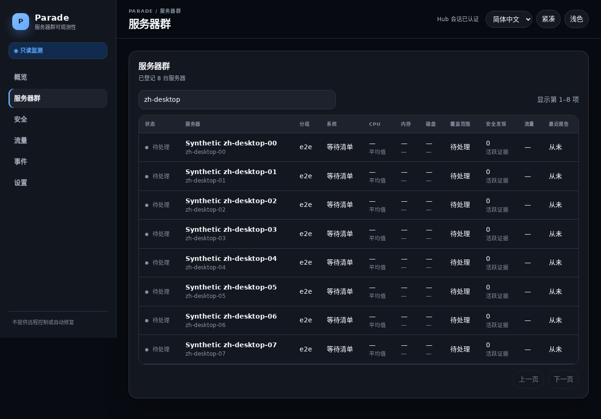

# Parade

[English](README.md) | [简体中文](README.zh-CN.md)

Parade 是一个自托管、低带宽、严格只读的 Linux VPS 多主机状态与安全态势观察台。它可以收集、汇总、比较、解释和告警，但绝不能远程控制或修改被监测主机。

生产部署只包含：

- 一个 Rust Hub 二进制；
- 每台 VPS 一个独立身份的 Rust Agent；
- 嵌入 Hub 的 Preact 界面；
- 嵌入式 SQLite/WAL 数据库。

无需外部数据库、消息队列、CDN、统计脚本或厂商 API。

```text
浏览器 --HTTPS--> 反向代理 --> Parade Hub --> SQLite WAL
                                  ^
                                  | 签名、压缩、低频上报
                                  |
                       非特权、仅出站的 Agent
                          只读取限定的 /proc 与 /sys
```

## 绝对安全边界

Parade 没有远程命令、Shell、脚本、任务、插件、任意文件读写、进程控制、服务控制、软件包操作、防火墙操作、用户操作、重启、关机、重装、厂商写入或自动修复接口。

Hub 只能通过闭合、有版本、短期自动过期的只读观察配置请求更多细节。Agent 不监听端口，只主动通过 HTTPS 连接 Hub；默认以专用非特权用户运行，不需要稳态 root 权限。

Agent 签名可以证明“哪个已注册身份发送了数据”，不能证明主机内核说的是真话。root 或内核已经失陷的主机可以隐藏或伪造所有本地遥测，因此界面绝不会宣称主机“安全”“干净”或“未失陷”。

## 界面与功能

- 中英文切换，首次跟随浏览器语言并在本机记忆选择；
- 简体中文日期使用 `YYYY年MM月DD日 HH:mm:ss`；
- 类 Apple 的克制圆角、半透明层次、深色/浅色主题；
- 桌面和约 390 像素移动端布局、键盘导航、可见焦点、减少动画；
- Fleet 总览、分组、时效、覆盖缺口和最多 24 条有界上报拓扑；
- CPU、负载、内存、Swap、PSI、硬盘、inode、网络接口和监听端口；
- 不采集环境变量和完整命令行的隐私保护进程视图；
- 带规则版本、置信度、首次/最近出现、证据和人工核验建议的安全发现；
- 事件、操作员审计、临时只读详情租约和真实带宽计量；
- 厂商当前周期流量种子、自动月结、追加式修正和可见不确定性。



更多合成测试截图： [英文桌面 Fleet](docs/screenshots/fleet-desktop.png)、[中文移动端 Fleet](docs/screenshots/fleet-zh-CN-mobile.png)、[移动端主机详情](docs/screenshots/server-overview-mobile.png)、[移动端流量计费](docs/screenshots/traffic-billing-modes-mobile.png)、[进程证据](docs/screenshots/process-evidence-desktop.png)、[网络证据](docs/screenshots/network-evidence-desktop.png)、[安全证据](docs/screenshots/security-evidence-desktop.png) 和 [透明流量种子](docs/screenshots/traffic-seed-preview-desktop.png)。截图只包含合成数据。

## 五分钟快速安装

GitHub Releases 页面存在版本后，在 x86_64 或 aarch64 Linux Hub 上可使用 HTTPS 便捷引导：

```bash
curl -fsSL https://github.com/jacek4yang/parade/releases/latest/download/parade-install.sh | sudo bash -s -- hub
```

这条 `curl | bash` 命令本身信任 GitHub HTTPS；脚本开始运行后，才会使用固定或人工确认的 Ed25519 发布公钥验证后续所有制品，不能宣称脚本在执行前已自证真实性。高保障环境必须先下载脚本和 Release 清单，通过独立渠道核对公钥摘要、验证 `SHA256SUMS.release` 签名及脚本哈希、审阅脚本后再执行，完整命令见运维指南。

安装程序会自动判断 Linux/CPU 架构，并通过控制终端选择 English 或简体中文。随后验证发布公钥摘要、Ed25519 签名、清单、二进制校验和与 Hub 自检，再询问公网地址和管理员密码。

登录后，在“设置”中分别创建主机 A、B、C……每台主机都会得到唯一、15 分钟、单次使用的注册命令。必须在与该记录对应的 VPS 上完整执行，不能复制一个令牌给多台机器。

NAT/CGNAT Agent 不需要端口映射，只需要能够出站访问 Hub HTTPS/443。有公网 IP 的 Agent 也不会开放 Parade 端口。若 Hub 位于 NAT 后，公网域名、HTTPS、端口映射或外部 VPN/代理由运维人员在 Parade 之外配置；Parade 不修改防火墙、路由，也不自动打洞或建立隧道。

完整的构建、签名、部署、注册、备份、升级、轮换、退役和故障排查流程见 [简体中文全生命周期运维指南](docs/zh-CN/OPERATIONS.md)。

## 厂商流量计费

当前里程碑不接入厂商 API。操作员从厂商面板读取本周期已经使用的流量，Parade 将它作为绑定精确 Agent 检查点的不可变种子，之后加上本机观察增量：

```text
厂商人工种子 + 种子后本地观察流量 + 仅追加审计调整 = 当前周期用量
```

支持闭合的五种计费方式：

- 入站 + 出站相加；
- 仅入站；
- 仅出站；
- 按入站/出站较大方向；
- 入站、出站分别计费并设置独立限额。

“较大方向”和“分别计费”必须同时输入厂商面板的入站与出站当前值，否则 Parade 无法正确判断后来哪个方向更大，会拒绝含糊的合计种子。系统不接受自定义公式、脚本或代码。

月度边界按 IANA 时区、日期 1–31 和本地时间自动触发，新周期从零开始，但绝不重置 Linux 计数器。跨边界离线且无法精确拆分时会显示 `estimated`；历史、原始种子和修正审计均保留。

## 有界资源与存储

- 默认每 10 秒在本地采样，每约 5 分钟加抖动上传紧凑汇总；
- 普通原始计数器最多每 60 秒耐久写入一次；boot/计数器 reset/新计数段、待发报告、回执、身份和策略变化仍立即落盘，避免崩溃重放重复计费，相比每次采样写盘约减少 83% 的正常稳定期耐久写入；
- 正常配置的确定性估算目标低于每 Agent 每 30 天 10 MiB，20 MiB 为回归硬上限；
- Agent 只保留一个待发报告、最多 64 个上报接口、32 个流量异常和 256 个同启动周期接口基线；
- 单个 procfs 读取最多 1 MiB；进程、端口、队列和临时详情均有硬上限；
- 资源汇总 30 天、流量汇总 90 天、进程/端口变化 7 天加最新值、事件 180 天、原始检查点 400 天；
- 清理任务每表每次最多删除 10,000 行，避免长事务；
- SQLite WAL 自动 checkpoint，保留 journal 上限 16 MiB；
- systemd 默认限制 Agent 内存 128 MiB、Hub 512 MiB，并限制任务数、文件描述符、日志速率和重启风暴。

运行 `scripts/performance-gate.sh` 可构建锁定依赖的 Release 二进制、记录 Git/机器/二进制哈希、阻止未使用的 WebSocket/gzip 依赖回归，并执行带宽、1,000 Agent 和 Hub 空闲资源门禁。2026年08月08日本机实测：Agent 2,947,936 字节、Hub 6,302,600 字节、正常上行 5.431 MiB/Agent/30 天（已计入每天一次 32 进程快照）、1,000 份签名报告 73.1 份/秒，Hub 空闲峰值 RSS 8,612 KiB、7 个文件描述符、5 个线程。测试机为 `powersave` 且 `perf_event_paranoid=3`，这些数字是可复现的回归基线，不冒充所有硬件的容量承诺。

journald 的总磁盘配额属于全机策略，安装器不会擅自修改。身份、墓碑、审计、安全发现、厂商种子、修正与周期历史是低频且有安全价值的持久证据，因此不能诚实承诺数据库在无限操作下“一个字节也不增长”；长期部署应按政策备份、导出和审查这些记录。

## 一行卸载

默认只删除本机程序与服务，保留配置、身份、流量状态、数据库与审计证据：

```bash
curl -fsSL https://github.com/jacek4yang/parade/releases/latest/download/parade-uninstall.sh | sudo bash -s -- agent
curl -fsSL https://github.com/jacek4yang/parade/releases/latest/download/parade-uninstall.sh | sudo bash -s -- hub
```

只有在完成证据与备份评估后才添加 `--purge`。卸载命令只能由主机本地管理员执行，Parade 不存在远程触发路径。

## 从源码构建与验证

```bash
cd frontend
npm ci
npm run build
cd ..
cargo build --release --workspace --all-features

cargo fmt --all -- --check
cargo clippy --workspace --all-targets --all-features -- -D warnings
cargo test --workspace --all-features
```

架构、安全边界、迁移和规范以 [AGENTS.md](AGENTS.md)、[ARCHITECTURE.md](ARCHITECTURE.md)、[THREAT_MODEL.md](THREAT_MODEL.md)、[TRAFFIC_ACCOUNTING_SPEC.md](TRAFFIC_ACCOUNTING_SPEC.md)、[UI_SPEC.md](UI_SPEC.md)、[MIGRATION.md](MIGRATION.md) 和 [SECURITY.md](SECURITY.md) 为准。
